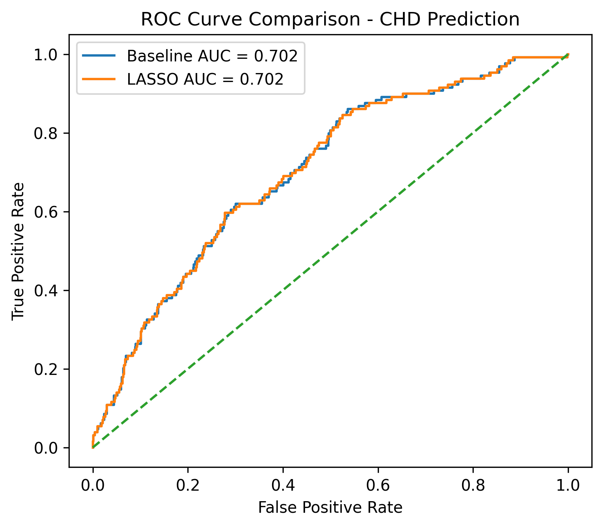
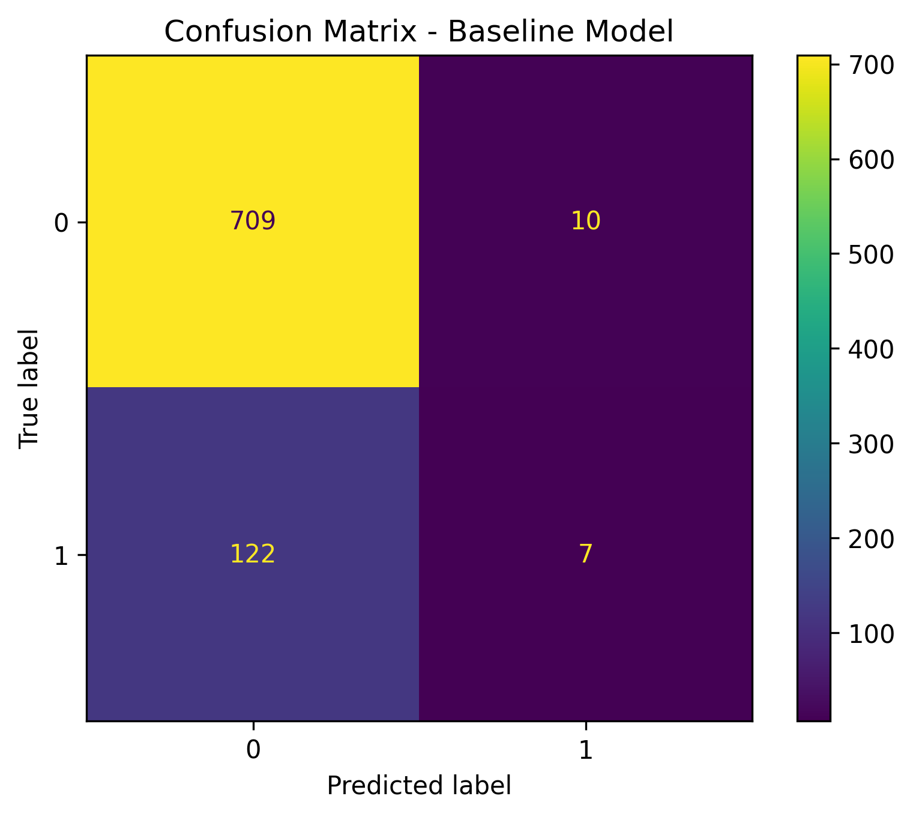
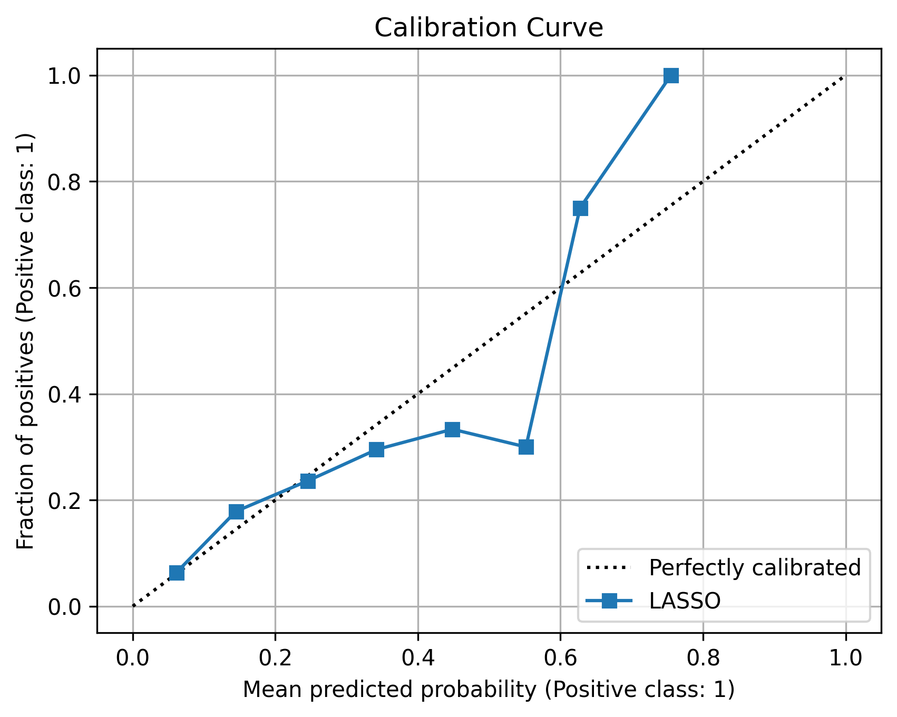
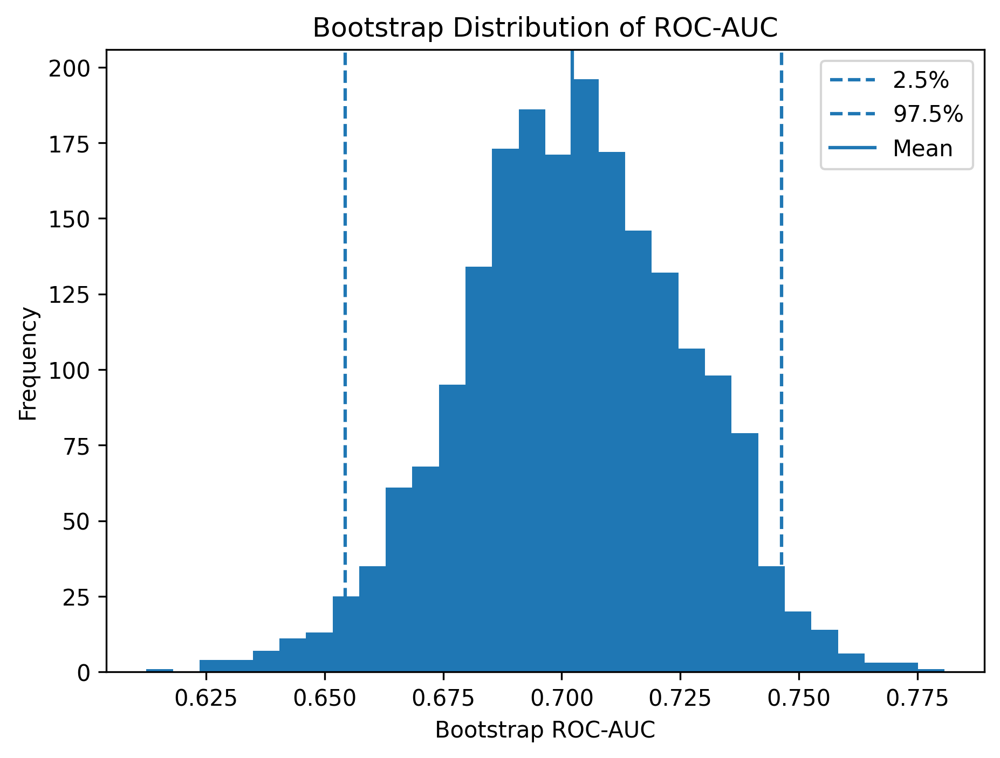

# Framingham CHD Risk Modeling

## Interpretable Statistical Learning for Ten-Year Coronary Heart Disease Risk Prediction

  

---

---

## Abstract
Cardiovascular disease remains one of the leading causes of mortality worldwide, making accurate and interpretable risk prediction an important problem in clinical decision-making. This project develops and evaluates statistical learning models for predicting 10-year coronary heart disease (CHD) risk using data from the Framingham Heart Study.

A baseline logistic regression model and a cross-validated LASSO logistic regression model were implemented within reproducible preprocessing pipelines incorporating median imputation and feature standardization. Model performance was evaluated using discrimination (ROC-AUC), calibration (Brier score and calibration curves), feature selection, bootstrap confidence intervals, and cross-validation to assess predictive stability.

The resulting models demonstrate competitive predictive performance while maintaining full interpretability, illustrating how classical statistical learning techniques remain valuable for clinical risk prediction.

---

## Project Focus

This repository emphasizes statistically rigorous model development, reproducible workflows, and interpretable clinical prediction rather than maximizing predictive accuracy through complex black-box algorithms.

---

## Key Results

- Cross-validated LASSO retained **12 of 15 predictors** while maintaining predictive performance.
- Baseline ROC-AUC: **0.702**
- LASSO ROC-AUC: **0.702**
- Five-fold Cross-Validation Mean ROC-AUC: **0.725 ± 0.012**
- Bootstrap 95% Confidence Interval: **0.654–0.746**
- LASSO achieved a slightly improved Brier Score (**0.1211**) relative to the baseline model.

---

## Clinical Motivation

Accurate prediction of long-term coronary heart disease risk enables earlier intervention and supports evidence-based preventive medicine. Although modern machine learning methods often emphasize predictive accuracy, clinical applications frequently require interpretable models whose risk factors can be directly communicated to physicians and patients.

Logistic regression remains one of the most widely used statistical models in clinical epidemiology because model coefficients can be interpreted as odds ratios, allowing direct assessment of the contribution of individual cardiovascular risk factors.

This project focuses on balancing predictive performance with statistical interpretability. 

---

## Dataset

**Dataset**: Framingham Heart Study

The Framingham Heart Study is one of the most influential longitudinal cardiovascular studies and has served as the basis for numerous clinical risk prediction models.

### Summary
- **Observations:** 4,240 patients
- **Predictors:** 15 demographic and clinical variables
- **Outcome:** TenYearCHD (binary)
- **Prediction Task:** Binary classification of 10-year coronary heart disease risk

Example predictors include:

- Age
- Sex
- Cigarette consumption
- Total cholesterol
- Systolic blood pressure
- Diastolic blood pressure
- Glucose
- Diabetes status
- Hypertension medication
- Heart rate

---

## Methods

### Study Design
A retrospective predictive modeling study was conducted using the Framingham Heart Study dataset to estimate 10-year coronary heart disease (CHD) risk.

### Data Preprocessing
All models were implemented using reproducible scikit-learn pipelines. Missing values were imputed using median imputation, and all predictors were standardized to zero mean and unit variance.

A stratified 80/20 train-test split was used to preserve outcome prevalence.

### Models
Two logistic regression-based models were evaluated:

- **Baseline Logistic Regression**
- **L1-Regularized Logistic Regression (LASSO)** with hyperparameter tuning via 5-fold cross-validation optimizing ROC-AUC.

### Evaluation Metrics
Model performance was assessed using:

- Discrimination: ROC-AUC
- Classification: Accuracy, Confusion Matrix
- Calibration: Brier Score, Calibration Curve
- Stability: k-fold cross-validation
- Uncertainty: Bootstrap confidence intervals for ROC-AUC

---

## Baseline Model

A standard logistic regression classifier served as the reference statistical model.

Evaluation metrics included:

- Accuracy
- ROC-AUC
- Confusion Matrix

---

## Cross-Validated LASSO Logistic Regression

To improve interpretability while reducing model complexity, LASSO regularization (L1 penalty) was applied.

Hyperparameter tuning was performed using 5-fold cross-validation with ROC-AUC as the optimization metric.

LASSO retained only the most informative predictors while maintaining comparable predictive performance.

---

## Model Evaluation

Rather than relying solely on classification accuracy, multiple complementary evaluation metrics were used.

### Discrimination
- Receiver Operating Characteristic (ROC) Curve
- Area Under the ROC Curve (ROC-AUC)
### Calibration
- Calibration Curve
- Brier Score

Calibration assesses whether predicted probabilities accurately reflect observed event frequencies, an important consideration for clinical prediction models.

### Statistical Stability

Model robustness was further evaluated using:
- 5-fold Cross-Validation
- Bootstrap estimation of ROC-AUC confidence intervals

---

## Results

Both models demonstrated comparable discriminative ability, with ROC-AUC values of approximately 0.70, consistent with standard clinical risk prediction baselines.

Cross-validated LASSO achieved slight improvements in predictive stability and calibration while reducing model complexity through feature selection.

### Predictive Performance

| Model | Accuracy | ROC-AUC | Brier Score |
|-------|---------:|---------:|------------:|
| Baseline Logistic Regression | 0.844 | 0.702 | 0.1214 |
| Cross-Validated LASSO | 0.847 | 0.702 | 0.1211 |

---

## Cross-Validation

Five-fold cross-validation produced a mean ROC-AUC of approximately 0.725 with low variability across folds, indicating consistent predictive performance.

---

## Bootstrap Analysis

Bootstrap resampling was used to quantify uncertainty in model performance.

**Mean Bootstrap ROC-AUC:** 0.702

**95% Confidence Interval:** (0.654, 0.746)

---

## Feature Selection

LASSO regularization reduced the original predictor set while preserving predictive performance.

The strongest predictors included:
- Age
- Systolic Blood Pressure
- Cigarette Consumption
- Sex
- Glucose

The complete coefficient estimates and odds ratios can be found in **figures/lasso_feature_importance.csv**.

--- 

## Visualizations
## ROC Curve



---

## Confusion Matrix



---

## Calibration Curve



---

## Bootstrap ROC-AUC Distribution



---

## Discussion 

This project demonstrates that carefully implemented statistical learning methods remain highly competitive for clinical prediction problems.

While more complex machine learning algorithms may achieve modest gains in predictive accuracy, logistic regression provides transparent parameter estimates that can be interpreted directly as odds ratios, supporting explainable clinical decision-making.

Cross-validated LASSO further improves interpretability by removing less informative predictors while maintaining essentially identical predictive performance.

---

## Clinical Interpretation

The model identifies age, systolic blood pressure, and smoking behavior as the strongest predictors of 10-year CHD risk. These findings align with established cardiovascular epidemiology, supporting the external validity of the model.

Importantly, LASSO regularization improves interpretability by removing weak predictors while maintaining equivalent predictive performance.

---

## Limitations

Several limitations should be considered:
- The Framingham dataset represents a single study population.
- External validation was not performed.
- The outcome is moderately imbalanced.
- Logistic regression assumes linear relationships between predictors and log-odds.
- Temporal and survival-based modeling approaches were not explored.

---

## Future Directions

Potential extensions include:
- Elastic Net regularization
- Gradient Boosting (XGBoost, LightGBM)
- Bayesian logistic regression
- Survival analysis using Cox proportional hazards models
- External validation on independent cardiovascular cohorts
- Model explainability using SHAP values
- Decision curve analysis for clinical utility

---

## Repository Structure

```text
framingham-chd-risk-modeling/
│
├── data/
├── notebooks/
├── figures/
├── models/
├── src/
├── requirements.txt
└── README.md
```

---

## Reproducibility

The analysis was implemented entirely in Python using:
- pandas
- NumPy
- scikit-learn
- matplotlib

All preprocessing, model fitting, evaluation, visualization, and statistical analyses are fully reproducible through the provided notebooks.

---

## Author
### Jenna Lu

B.S. Statistics, University of Florida

Interests: Statistical Learning • Biostatistics • Health Data Science • Clinical Informatics • Artificial Intelligence
